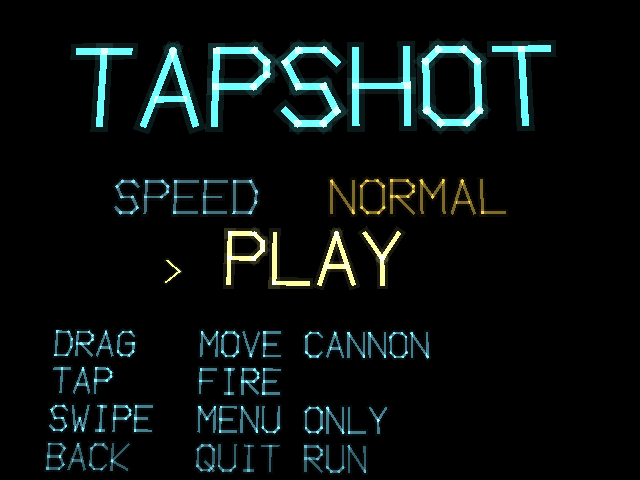
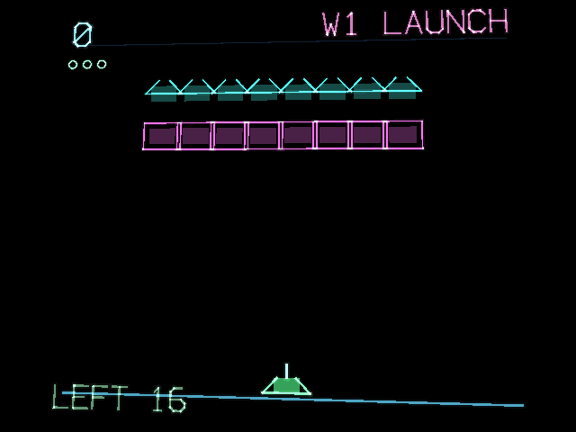

# tapshot — a gallery shooter for the RayNeo X3 Pro

Free software, GPL v3 (see LICENSE). Derived from `x3breakout`, which is GPL v3.

Your laser cannon is locked to the bottom axis. Slide it, shoot upward, don't
get hit.

## Screenshots

<p>
  
  
</p>

## Two inputs, and that is the whole game

| gesture | |
|---|---|
| **drag** | slide the cannon |
| **tap** | fire |
| swipe | menu only |
| BACK | quit a run |

The cannon follows the pad's absolute calibrated position, so your finger *is*
the cannon. **Nothing is bound to a double tap** — two shots in quick succession
are the most ordinary thing a player does in a shooter, and anything bound there
would fire while they were simply shooting twice.

## The goals are borrowed from machines that proved them

Six waves, cycling, no two consecutive waves asking the same thing:

| wave | goal | borrowed from |
|---|---|---|
| LAUNCH | clear the formation | **Space Invaders** (1978) |
| ORBIT | they break formation and dive | **Galaxian** (1979) |
| SWARM | clear it, faster as it thins | Space Invaders |
| RESCUE | free the captives — shoot the captor, not the captive | **Galaga** (1981) |
| SIEGE | hold your shields | **Missile Command** (1980) |
| BONUS | nobody shoots back | Galaga's challenge stage |

**The formation accelerates as it thins.** That is the single most copied
mechanic in the genre and it began as a hardware accident: fewer sprites meant a
faster frame on 1978 silicon. It survived because the tension curve it produces
is close to perfect and nothing designed on purpose has beaten it. It is where
this game's difficulty comes from.

**RESCUE is the interesting one.** A captured ship flies alongside its captor;
kill the captor and you get it back, worth 200. Shoot the captive and you simply
lose the rescue — no life lost, because the wave is *about* aiming, and
punishing it twice would only teach players not to try. A goal that penalises
indiscriminate fire is the most interesting idea in any of these machines.

## Colourful, and deliberately not intense

- Enemy fire is rate-limited **for the whole wave**, not per enemy. Thirty
  enemies each deciding to shoot is a bullet hell; the brief was a game you can
  enjoy without clenching.
- Dives arrive one at a time and curve lazily toward your side, so they are
  dodged by moving rather than by reacting.
- Every sixth wave nobody shoots back at all.
- Reaching the bottom costs a life and resets the formation — it is not an
  instant loss, so a bad wave is recoverable.
- **SPEED: RELAXED** on the menu slows the board and thins the fire further.
  Applied at wave setup rather than baked into the table, so there is only one
  difficulty curve to reason about.

Three enemy silhouettes rather than three colours of the same box: at a glance
you must know what is in front of you, and colour alone fails the moment two
kinds overlap.

## Music

Six tracks from the same library as the other X3 games, one per wave, in
`assets/music` — alphabetical order is wave order.

## Build

```
./gradlew :app:assembleDebug
adb -s <glasses-serial> install -r app/build/outputs/apk/debug/tapshot.apk
```

Two devices are usually attached, so `-s` is not optional. The glasses report
`model:ARGF20`, `manufacturer:RayNeo`.

## Notes measured on the device

- Visible field is about **±0.144 across, ±0.117 up** in plane-local metres.
- The vector font advances ~**5.4×** its size parameter per character and a
  glyph is ~**7.3×** that parameter tall.
- The touchpad carries the flick fix from `taprhythm`: a stroke commits to a
  direction at 26 px and fires once, instead of needing 90 px and then firing
  again every 90 px after that.
- **If nothing appears, check `batch.setBasis(...)` is still called in
  `Game.update`.**
